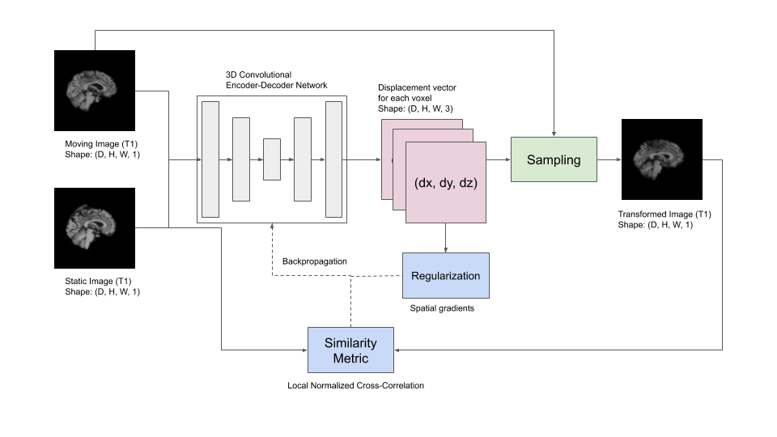
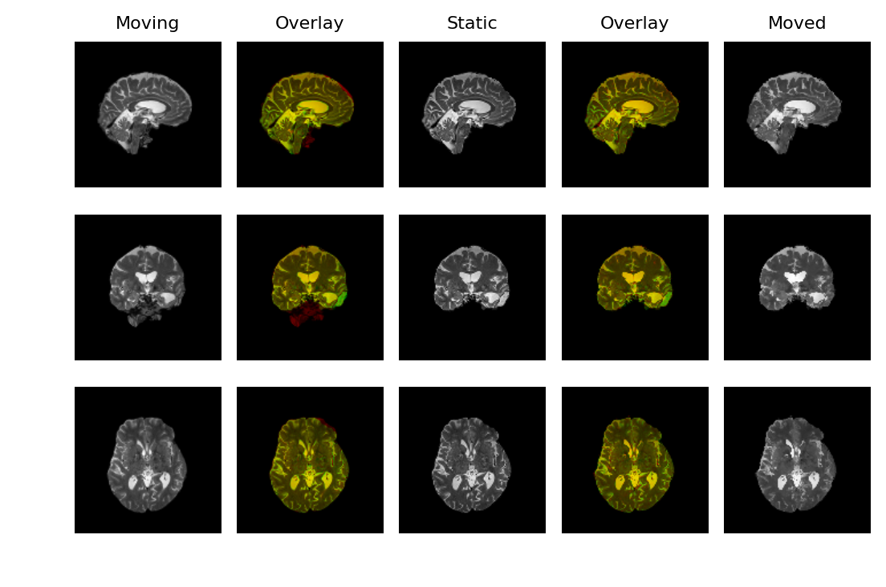

# Implementation of the VoxelMorph Model (CVPR 2018)
Paper: [An Unsupervised Learning Model for
Deformable Medical Image Registration](https://openaccess.thecvf.com/content_cvpr_2018/papers/Balakrishnan_An_Unsupervised_Learning_CVPR_2018_paper.pdf)


## Framework
Given a moving image and the static image as inputs, the convolutional encoder-decoder network computes the pixel-wise deformation between the two images. This deformation field also called a registration field, gives the new sampling locations in the moving image. The transformed image is obtained by sampling the moving image at these locations. Simply put, we are just rearranging the pixels in the moving image until it matches the static image as much as possible.
<p align="center"> 
  
</p>
The network is trained by optimizing a similarity metric (normalized cross-correlation) between the transformed and the static images. Once the training is finished, the network can predict the optimal registration field in one go, unlike the traditional algorithms, which involve numerical optimization for every new pair, thereby taking longer durations.


## Usage

#### Colab notebook
https://colab.research.google.com/drive/1-lPuD4vRCeihKYMQKDDXLYq1dxm-3tJR?usp=sharing

#### Training
```bash
$ python3 main.py --epochs 60 --batch_size 1 --lr 1e-3
```
#### Dependencies
* Python 3
* TensorFlow 2
* numpy, matplotlib, argparse

#### Files
`metrics.py` - loss functions (normalized cross-correlation and gradient loss)  
`viz.py` - helper tools to visualize registration results  
`models.py` - VoxelMorph models' architectures  
`dataloader.py` - for fetching and preprocessing batches of images for real-time data feeding to the model  
`utils.py` - utilities for differntiable image sampling  
`voxelmorph.ipynb` - copy of the Colab notebook  


## Sample results
#### T1-weighted images
#### T2-weighted images
<p align="center"> 
  
</p>

## References
*   Balakrishnan, G., Zhao, A., Sabuncu, M.R., Guttag, J. and Dalca, A.V., 2018. An unsupervised learning model for deformable medical image registration. In Proceedings of the IEEE conference on computer vision and pattern recognition (pp. 9252-9260).
*   Jaderberg, M., Simonyan, K. and Zisserman, A., 2015. Spatial transformer networks. In Advances in neural information processing systems (pp. 2017-2025).
*   Spatial Transformer Networks by Kushagra Bhatnagar. https://link.medium.com/0b2OrmqVO5
*   [Original VoxelMorph implementation](https://github.com/voxelmorph/voxelmorph)
*   [TensorFlow implementation of spatial transformer networks](https://github.com/tensorflow/models/tree/master/research/transformer)


